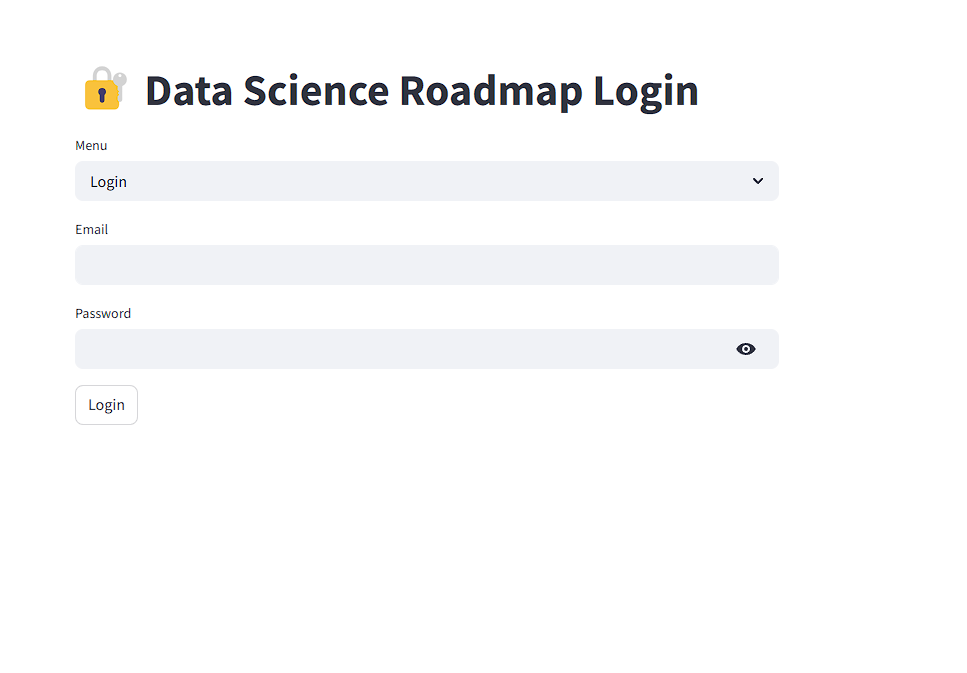
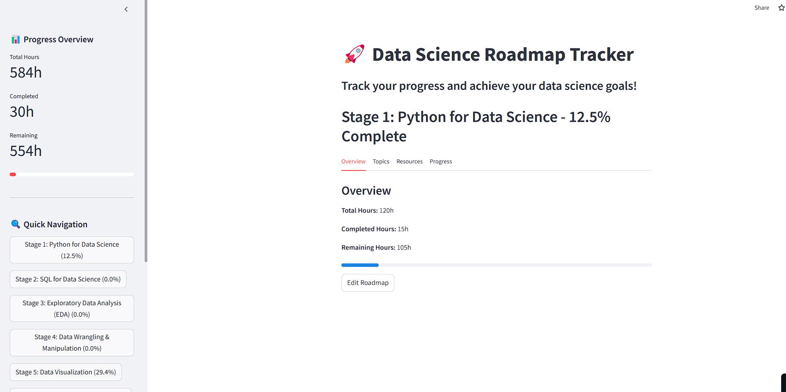

# 🚀 Data Science Roadmap Tracker
As an aspiring data scientist, I often struggled to track my progress effectively. To solve this problem, I developed this web application using **Streamlit**. It helps users like me manage their learning journey by providing a structured roadmap, progress tracking, and curated resources. I hope this app will also help others on their data science journey.
This project is a testament to my **problem-solving skills**—identifying a challenge and creating a solution for it.
You can explore the app here: [Data Science Roadmap Tracker](https://mydsjourney.streamlit.app/)
The app includes a detailed roadmap with stages, topics, and resources, allowing users to log their progress, edit the roadmap, and manage their learning journey.

---

## Features

- **User Authentication**:
  - Sign up and log in with email and password.
  - User-specific progress tracking.

- **Roadmap Stages**:
  - Predefined stages for learning data science, including Python, SQL, EDA, Machine Learning, and more.

- **Progress Tracking**:
  - Mark topics as completed.
  - View progress metrics (total hours, completed hours, remaining hours).

- **Resource Management**:
  - Access curated resources (books, documentation, videos, practice sites, research papers) for each stage.

- **Customizable Roadmap**:
  - Add, edit, or replace topics and resources as per your learning needs.

- **Database Integration**:
  - User data and progress are stored in an SQLite database.

---

## Installation

1. **Clone the Repository**:
   ```bash
   git clone https://github.com/DhawaDG/Datascience_Roadmap_Tracker
   cd data-science-roadmap-tracker
   ```

2. **Install Dependencies**:
   Create a virtual environment and install the required Python packages:
   ```bash
   python -m venv venv
   source venv/bin/activate  # On Windows: venv\Scripts\activate
   pip install -r requirements.txt
   ```

3. **Run the Application**:
   ```bash
   streamlit run main.py
   ```

4. **Access the App**:
   Open your browser and go to `http://localhost:8501`.

---

## Deployment

To deploy the app, you can use **Streamlit Community Cloud** or other hosting platforms like **Heroku**, **AWS**, or **Google Cloud**.

### Deploy on Streamlit Community Cloud:
1. Push your code to a GitHub repository.
2. Go to [Streamlit Community Cloud](https://share.streamlit.io/).
3. Select your repository and deploy the app.

---

## Roadmap Stages

The app includes the following stages:
1. **Python for Data Science**
2. **SQL for Data Science**
3. **Exploratory Data Analysis (EDA)**
4. **Data Wrangling & Manipulation**
5. **Data Visualization**
6. **Statistics & Probability**
7. **Feature Engineering**
8. **ETL (Extract, Transform, Load)**
9. **Machine Learning (Core)**
10. **Communication & Git**

Each stage includes:
- Topics with estimated time to complete.
- Curated resources (books, documentation, videos, practice sites, research papers).

---

## Screenshots

### Login Page



### Roadmap Overview



---

## Technologies Used

- **Frontend**: Streamlit
- **Backend**: SQLite for database
- **Programming Language**: Python

---

## Contributing

Contributions are welcome! If you'd like to contribute, please follow these steps:
1. Fork the repository.
2. Create a new branch (`git checkout -b feature-branch`).
3. Commit your changes (`git commit -m "Add new feature"`).
4. Push to the branch (`git push origin feature-branch`).
5. Open a Pull Request.

---

## License

This project is licensed under the MIT License. See the [LICENSE](LICENSE) file for details.

---

## Contact

For any questions or feedback, feel free to reach out:
- **Email**: dawa.sonofgod.247@gmail.com
- **GitHub**:https://github.com/DhawaDG
